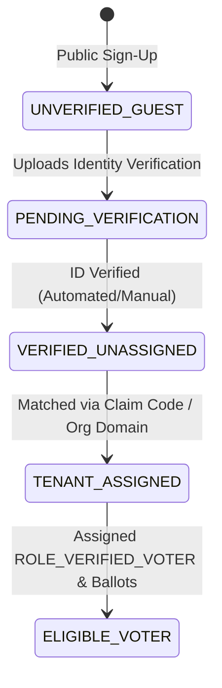
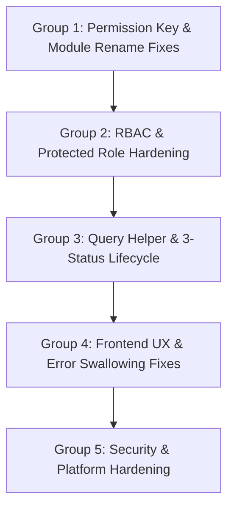

# System Workflow & Multi-Tenant Architecture

## 1. System Vision & Domain Model

The Voatz platform is a multi-tenant Election Management System built on a SaaS architecture. The platform supports three primary user categories:

1. **Platform Administrator (Product Owner / SaaS Admin)**: Manages companies, defines system modules/actions, provisions initial Company Super Admins, manages system-protected roles, and oversees platform-wide cross-company elections.
2. **Tenant Organizations (Companies)**: Isolated organizations running elections, managing departments, assigning roles to staff users, registering voters, and tallying results.
3. **Voters (Admin-Provisioned & Self-Registered)**: Individuals eligible to cast votes on ballots. Supports both admin-imported voter rolls and dynamic public self-registration workflows.

---

## 2. Global Timezone Standard

- **Standard Timezone**: **Indian Standard Time (IST - UTC+05:30)**.
- All election start/end datetimes, registration deadlines, vote timestamps, and audit logs are recorded and evaluated using IST.
- Datetime comparisons in business logic convert database timestamps and current timestamps into IST aware datetimes to prevent naive vs. aware comparison errors.

---

## 3. End-to-End Operational Workflows

### **Tier 1: Platform Administrator Flow (SaaS Owner)**
1. **Authentication**: Platform Admin logs in (`is_administrator = True`).
2. **Company Creation**: Onboards a new Tenant Company (`Company` record). Note: Unspecified module lists default to zero provisioning (deny-by-default).
3. **Super Admin Creation**: Provisions the primary **Company Super Admin** user for that company.
4. **Module Provisioning**: Maps explicit `Module` entries to `company_modules`, granting specific feature entitlements.

### **Tier 2: Company Super Admin Setup (Organization Owner)**
1. **Authentication**: Log in as Company Super Admin (`is_super_admin = True` for `company_id`).
2. **Organizational Hierarchy**:
   - Creates **Departments** (e.g. *HR, Board of Directors*).
   - Creates custom **Roles** (e.g. *Election Officer, Registrar*). Note: The system `Company Super Admin` role (`is_system = True`) is protected and can only be modified by Platform Admin.
   - Provisions **Staff Users** and maps them to roles and departments via `UserRoleMapping`.
3. **Election Setup**:
   - Creates an `Election` record (Title, Type, Category, IST Start/End dates).
   - Creates `Ballot` records (Title, Position, Choice limits, Jurisdiction rules).
   - Creates `Candidate` records under ballots.
4. **Activation**: Changes election status to `1` (Active).

### **Tier 3: Voter Provisioning & Registration Workflows**

#### Option A: Admin Batch Import
1. Staff imports voter list via CSV or API (`Voter` table).
2. `VoterRegistration` record links `Voter` and `Election`.
3. Staff approves registration (`status = 'approved'`), granting ballot eligibility.

#### Option B: Dynamic Voter Self-Registration Flow

1. **Public Sign-Up**: Voter signs up publicly and receives `ROLE_SELF_REGISTERED_GUEST` (`status = 'unverified'`).
2. **Identity Verification**: Voter submits verification credentials (Govt ID / Proof of Residence).
3. **Verification & Tenant Matching**: System or Admin approves verification and matches voter to their tenant (`company_id`).
4. **Role Transition**: User transitions to `ROLE_VERIFIED_VOTER` with access to assigned ballots.

---

## 4. Multi-Tenant Data Isolation & Cross-Company Elections

### Data Isolation Invariants
1. **Company Scoping**: Every domain entity (`User`, `Role`, `Department`, `Election`, `Ballot`, `Candidate`, `Voter`, `VoterRegistration`, `Vote`, `AuditLog`) MUST include a `company_id` foreign key.
2. **Unified Query Scoping**: Queries must use `Model.query_tenant(current_user)` to ensure cross-tenant leaks are impossible.
3. **Deny-by-Default Provisioning**: Unprovisioned modules respond with `403 Forbidden` for tenant users.

### Cross-Company (Inter-Tenant) Election Engine
When an election spans multiple organizations (e.g. Consortium or Joint Venture elections):
1. **Election Ownership**: Owned by Platform Admin (`company_id = NULL`) or Host Company.
2. **Scope Junction Table**: Connected to multiple participating companies via `ElectionCompanyScope`.
3. **Isolated Access**: Voters from participating companies can view and vote on the shared ballot, but Company A Super Admin CANNOT access Company B's internal users or data.

---

## 5. Master Bug Catalog & Connected Refactoring Plan

All identified platform bugs have been categorized into 5 connected fix clusters:

### Bug Cluster Breakdown

#### Group 1: Permission Key & Module Rename Fixes
* **Bug 1.1**: Module rename breaks React `hasPermission('Modules', 'view')` checks due to display name key coupling. *Fix: Decouple display name from permanent immutable `code`.*
* **Bug 1.2**: Navigation routing falls into broken path when display name changes. *Fix: Key navigation off immutable `code`.*
* **Bug 1.3**: `create_module` / `update_module` lack Platform Admin restriction for route key mutation. *Fix: Guard module schema updates with Platform Admin check.*

#### Group 2: RBAC & Protected Role Hardening
* **Bug 2.1**: Company Super Admin can edit/delete system `Company Super Admin` role. *Fix: Add backend `is_system` protection guard returning 403 unless Platform Admin.*
* **Bug 2.2**: `companies.py` provisions all modules by default on company creation. *Fix: Fall back to zero provisioning.*
* **Bug 2.3**: Database missing unique composite constraints on mapping tables. *Fix: Add DB migration with composite unique indexes.*

#### Group 3: Unified Query Helpers & 3-Status Entity Lifecycle
* **Bug 3.1**: Inconsistent status queries across `query_helpers.py` (`status != 0` vs `status == 1`). *Fix: Implement `TenantScopedMixin` with `StatusEnum` (`1=Active, 0=Inactive, 9=Deleted`).*
* **Bug 3.2**: Repetitive query filter code in 20+ routes. *Fix: Replace custom queries with `Model.query_tenant(current_user)`.*

#### Group 4: Frontend UX & Error Swallowing Fixes
* **Bug 4.1**: 3-Popup delete confirmation bug in `Departments.js`, `Roles.js`, `Users.js`, `Companies.js`, and `UserRoles.js`. *Fix: Remove duplicate `showDeleteConfirm` trigger.*
* **Bug 4.2**: Catch blocks discarding real API error messages into generic `"Failed to load"`. *Fix: Propagate `err.response?.data?.error` to UI toasts.*
* **Bug 4.3**: Inconsistent status toggle UI across CRUD screens. *Fix: Implement `<StatusToggle />` switch.*

#### Group 5: Security & Platform Hardening
* **Bug 5.1**: Lack of login rate limiting. *Fix: Add Flask-Limiter to `/api/auth/login`.*
* **Bug 5.2**: Vote hash using plain SHA-256 instead of HMAC/salted commitment. *Fix: Implement HMAC vote integrity signature.*
* **Bug 5.3**: Missing JWT token revocation / refresh flow. *Fix: Add token blacklist check.*
