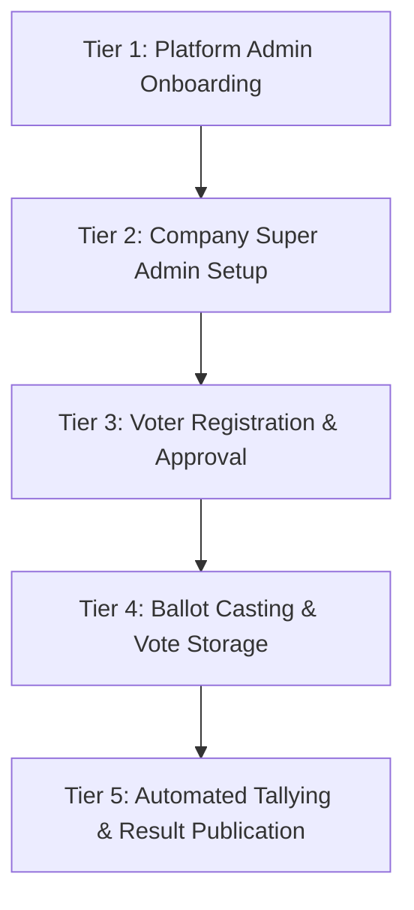

# System Workflow & Multi-Tenant Architecture

## 1. System Vision & Domain Model

The Voatz platform is a multi-tenant Election Management System built on a SaaS architecture. The platform supports two main user tiers:

1. **Platform Administrator (Product Owner / SaaS Admin)**: Manages companies, defines available system modules and actions, and provisions initial Company Super Admins.
2. **Tenant Organizations (Companies)**: Isolated organizations running elections, managing departments, assigning roles to staff users, registering voters, and tallying results.

---

## 2. Global Timezone Standard

- **Standard Timezone**: **Indian Standard Time (IST - UTC+05:30)**.
- All election start/end datetimes, registration deadlines, vote timestamps, and audit logs are recorded and evaluated using IST.
- Datetime comparisons in business logic (such as checking if an election is active or if voting windows are open) convert database timestamps and current timestamps into IST aware datetimes to prevent naive vs. aware comparison errors.

---

## 3. End-to-End 5-Tier Operational Workflow

### **Tier 1: Platform Administrator Flow (SaaS Owner)**
1. **Authentication**: Platform Admin logs in (`is_administrator = True`).
2. **Company Creation**: Onboards a new Tenant Company (`Company` record).
3. **Super Admin Creation**: Provisions the primary **Company Super Admin** user for that company.
4. **Module & Action Provisioning**: Creates `Module` and `ModuleAction` records for the company, granting specific feature entitlements (e.g. *Elections, Ballots, Candidates, Voters, VoterRegistrations, Votes*).

### **Tier 2: Company Super Admin Setup (Organization Owner)**
1. **Authentication**: Log in as Company Super Admin (`is_super_admin = True` for `company_id`).
2. **Organizational Hierarchy**:
   - Creates **Departments** (e.g. *HR, Board of Directors*).
   - Creates custom **Roles** (e.g. *Election Officer, Registrar*).
   - Provisions **Staff Users** and maps them to roles and departments via `UserRoleMapping`.
3. **Election Setup**:
   - Creates an `Election` record (Title, Type, Category, IST Start/End dates).
   - Creates `Ballot` records (Title, Position, Choice limits, Jurisdiction rules).
   - Creates `Candidate` records under ballots.
4. **Activation**: Changes election status to `active`.

### **Tier 3: Voter Provisioning & Registration (Admin/API-Driven)**
1. **No Self-Registration**: Voters do not self-register on a public portal.
2. **Voter Creation**: Voters are created by staff or via batch API (`Voter` table).
3. **Election Registration**: A `VoterRegistration` record is linked between `Voter` and `Election`.
4. **Verification & Approval**: Staff approves the registration (`status = 'approved'`), granting ballot eligibility.

### **Tier 4: Ballot Casting & Secure Vote Storage**
1. **Eligibility Enforcement**:
   - Verifies election is active (in IST window).
   - Verifies ballot is published and active.
   - Verifies voter has an `approved` registration for the election and has not voted on the ballot yet.
2. **Vote Submission**: Voter selection is recorded in `Vote` table with a unique tracking code (`Vote ID`).
3. **Isolation**: Vote records are strictly bound to `company_id` and stored in uncounted/pending status.

### **Tier 5: Automated Vote Tallying & Results Publication**
1. **Election Completion**: Voting window closes or Admin marks election status as `completed`.
2. **Automated Bulk Tally (`POST /api/elections/<id>/tally`)**:
   - Verifies and processes pending votes.
   - Atomically updates candidate total votes (`total_votes_received`), ballot totals (`total_votes_cast`), and election turnout.
3. **Publish Results (`POST /api/elections/<id>/publish-results`)**:
   - Sets `results_published = True`.
   - Exposes audited result breakdowns and chart analytics to authorized dashboards.

---

## 4. Multi-Tenant Data Isolation Invariants

1. **Company Scoping**: Every domain entity (`User`, `Role`, `Department`, `Election`, `Ballot`, `Candidate`, `Voter`, `VoterRegistration`, `Vote`, `AuditLog`) MUST include a `company_id` foreign key.
2. **Cross-Tenant Guard**: Non-platform administrator requests attempting to access data outside their JWT token's `company_id` MUST return **HTTP 404 (Not Found)** or **HTTP 403 (Forbidden)**.
3. **Platform Admin Entitlement Guard**: A Company Super Admin ONLY has access to modules and actions explicitly provisioned for their `company_id` by the Platform Administrator.
