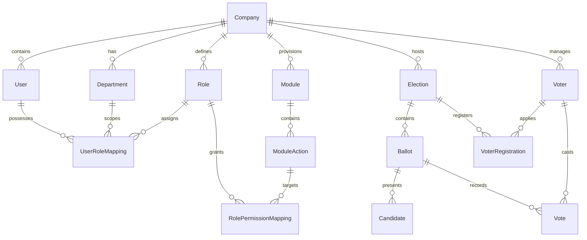

# Database Schema & Model Specification

This document details the complete relational database schema for the Voatz platform. All models inherit from `BaseModel` which provides common audit fields (`created_at`, `created_by`, `updated_at`, `updated_by`).

---

## 1. Entity-Relationship Overview

---

## 2. Core Tables & Schemas

### **2.1 `companies` Table**
Stores onboarded tenant organizations.

| Column Name | Data Type | Constraints | Description |
| :--- | :--- | :--- | :--- |
| `id` | INTEGER | PRIMARY KEY, AUTOINCREMENT | Unique company ID |
| `company_name` | VARCHAR(100) | NOT NULL, UNIQUE (case-insensitive) | Company name |
| `code` | VARCHAR(20) | UNIQUE, NULLABLE | Company short code |
| `status` | INTEGER | DEFAULT 1 | 1=Active, 0=Inactive, 9=Deactivated |
| `created_at` | DATETIME | DEFAULT IST | Creation timestamp |
| `updated_at` | DATETIME | DEFAULT IST | Last update timestamp |

---

### **2.2 `departments` Table**
Stores departments within a company.

| Column Name | Data Type | Constraints | Description |
| :--- | :--- | :--- | :--- |
| `id` | INTEGER | PRIMARY KEY, AUTOINCREMENT | Unique department ID |
| `company_id` | INTEGER | FOREIGN KEY (`companies.id`), NOT NULL | Parent company ID |
| `department_name` | VARCHAR(100) | NOT NULL | Department name |
| `description` | TEXT | NULLABLE | Department description |
| `status` | INTEGER | DEFAULT 1 | 1=Active, 0=Inactive |

---

### **2.3 `roles` Table**
Stores company roles and permissions definitions.

| Column Name | Data Type | Constraints | Description |
| :--- | :--- | :--- | :--- |
| `id` | INTEGER | PRIMARY KEY, AUTOINCREMENT | Unique role ID |
| `company_id` | INTEGER | FOREIGN KEY (`companies.id`), NOT NULL | Parent company ID |
| `role_name` | VARCHAR(100) | NOT NULL | Role name |
| `description` | TEXT | NULLABLE | Role description |
| `is_super_admin` | BOOLEAN | DEFAULT FALSE | Grants Company Super Admin privileges |
| `status` | INTEGER | DEFAULT 1 | 1=Active, 0=Inactive |

---

### **2.4 `users` Table**
Stores user accounts for platform administrators, company super admins, and staff.

| Column Name | Data Type | Constraints | Description |
| :--- | :--- | :--- | :--- |
| `id` | INTEGER | PRIMARY KEY, AUTOINCREMENT | Unique user ID |
| `company_id` | INTEGER | FOREIGN KEY (`companies.id`), NULLABLE (Null for Platform Admin) | Parent company ID |
| `name` | VARCHAR(100) | NOT NULL | Full user name |
| `email` | VARCHAR(120) | NOT NULL, UNIQUE | User email address |
| `password_hash` | VARCHAR(255) | NOT NULL | Hashed password |
| `is_administrator` | BOOLEAN | DEFAULT FALSE | True for Platform Administrator |
| `status` | INTEGER | DEFAULT 1 | 1=Active, 0=Inactive |

---

### **2.5 `user_role_mappings` Table**
Maps users to roles (and optionally departments).

| Column Name | Data Type | Constraints | Description |
| :--- | :--- | :--- | :--- |
| `id` | INTEGER | PRIMARY KEY, AUTOINCREMENT | Mapping ID |
| `company_id` | INTEGER | FOREIGN KEY (`companies.id`), NOT NULL | Company scope |
| `user_id` | INTEGER | FOREIGN KEY (`users.id`), NOT NULL | User ID |
| `role_id` | INTEGER | FOREIGN KEY (`roles.id`), NOT NULL | Role ID |
| `department_id` | INTEGER | FOREIGN KEY (`departments.id`), NULLABLE | Optional Department ID |
| `status` | INTEGER | DEFAULT 1 | Mapping status |

---

### **2.6 Master Catalog & Company Provisioning Tables**

#### `system_modules` (Global Master Catalog)
Stores the SaaS platform's global catalog of modules, managed exclusively by the Platform Administrator.

| Column Name | Data Type | Constraints | Description |
| :--- | :--- | :--- | :--- |
| `id` | INTEGER | PRIMARY KEY, AUTOINCREMENT | Module ID |
| `module_name` | VARCHAR(100) | NOT NULL, UNIQUE | Module name (e.g. *Users, Roles, Elections*) |
| `route_name` | VARCHAR(100) | NULLABLE | Custom frontend route slug |
| `icon` | VARCHAR(100) | DEFAULT 'folder' | Sidebar icon name |
| `order_index` | INTEGER | DEFAULT 0 | Sidebar display order |
| `status` | INTEGER | DEFAULT 1 | 1=Active, 9=Inactive |

#### `system_module_actions` (Global Master Actions)
Stores default actions associated with a master module.

| Column Name | Data Type | Constraints | Description |
| :--- | :--- | :--- | :--- |
| `id` | INTEGER | PRIMARY KEY, AUTOINCREMENT | Action ID |
| `system_module_id` | INTEGER | FOREIGN KEY (`system_modules.id`), NOT NULL | Parent master module ID |
| `action_name` | VARCHAR(100) | NOT NULL | Action name (*view, create, update, delete*) |
| `action_url` | VARCHAR(255) | NOT NULL | API endpoint URL pattern |
| `status` | INTEGER | DEFAULT 1 | 1=Active, 0=Inactive |

#### `company_modules` (Tenant Provisioning Map)
Maps which master system modules are provisioned for a specific company tenant.

| Column Name | Data Type | Constraints | Description |
| :--- | :--- | :--- | :--- |
| `id` | INTEGER | PRIMARY KEY, AUTOINCREMENT | Mapping ID |
| `company_id` | INTEGER | FOREIGN KEY (`companies.id`), NOT NULL | Company ID |
| `system_module_id` | INTEGER | FOREIGN KEY (`system_modules.id`), NOT NULL | Provisioned master module ID |
| `status` | INTEGER | DEFAULT 1 | 1=Active, 0=Inactive |

---

### **2.7 `role_permission_mappings` Table**
Grants action-level access on a module to a specific role.

| Column Name | Data Type | Constraints | Description |
| :--- | :--- | :--- | :--- |
| `id` | INTEGER | PRIMARY KEY, AUTOINCREMENT | Mapping ID |
| `company_id` | INTEGER | FOREIGN KEY (`companies.id`), NOT NULL | Company scope |
| `role_id` | INTEGER | FOREIGN KEY (`roles.id`), NOT NULL | Role ID |
| `module_id` | INTEGER | FOREIGN KEY (`modules.id`), NOT NULL | Module ID |
| `action_id` | INTEGER | FOREIGN KEY (`module_actions.id`), NOT NULL | Action ID |
| `permission_type` | INTEGER | DEFAULT 1 | 1=Allow, 0=Deny |

---

### **2.8 `elections` Table**
Stores election configuration and overall tally statistics.

| Column Name | Data Type | Constraints | Description |
| :--- | :--- | :--- | :--- |
| `id` | INTEGER | PRIMARY KEY, AUTOINCREMENT | Election ID |
| `company_id` | INTEGER | FOREIGN KEY (`companies.id`), NOT NULL | Company ID |
| `title` | VARCHAR(255) | NOT NULL | Election title |
| `election_code` | VARCHAR(50) | UNIQUE, NOT NULL | Unique election code |
| `election_type` | VARCHAR(50) | DEFAULT 'general' | General, Primary, Referendum |
| `start_date` | DATETIME | NOT NULL | Voting start time (IST) |
| `end_date` | DATETIME | NOT NULL | Voting end time (IST) |
| `registration_deadline`| DATETIME | NULLABLE | Registration deadline (IST) |
| `status` | VARCHAR(50) | DEFAULT 'draft' | `draft`, `active`, `completed`, `cancelled` |
| `results_published` | BOOLEAN | DEFAULT FALSE | Results visibility flag |
| `total_votes_cast` | INTEGER | DEFAULT 0 | Total tallied votes |
| `total_registered_voters`| INTEGER | DEFAULT 0 | Approved voter count |

---

### **2.9 `ballots` & `candidates` Tables**

#### `ballots`
| Column Name | Data Type | Constraints | Description |
| :--- | :--- | :--- | :--- |
| `id` | INTEGER | PRIMARY KEY, AUTOINCREMENT | Ballot ID |
| `company_id` | INTEGER | FOREIGN KEY (`companies.id`), NOT NULL | Company ID |
| `election_id` | INTEGER | FOREIGN KEY (`elections.id`), NOT NULL | Parent election ID |
| `title` | VARCHAR(255) | NOT NULL | Ballot race title |
| `position_title` | VARCHAR(100) | NOT NULL | Target office/position |
| `ballot_type` | VARCHAR(50) | DEFAULT 'single_choice' | Choice rule |
| `min_selections` | INTEGER | DEFAULT 1 | Min required choices |
| `max_selections` | INTEGER | DEFAULT 1 | Max allowed choices |
| `is_published` | BOOLEAN | DEFAULT FALSE | Published flag |
| `is_active` | BOOLEAN | DEFAULT TRUE | Active flag |

#### `candidates`
| Column Name | Data Type | Constraints | Description |
| :--- | :--- | :--- | :--- |
| `id` | INTEGER | PRIMARY KEY, AUTOINCREMENT | Candidate ID |
| `company_id` | INTEGER | FOREIGN KEY (`companies.id`), NOT NULL | Company ID |
| `ballot_id` | INTEGER | FOREIGN KEY (`ballots.id`), NOT NULL | Parent ballot ID |
| `name` | VARCHAR(150) | NOT NULL | Candidate full name |
| `biography` | TEXT | NULLABLE | Candidate bio |
| `party_affiliation`| VARCHAR(100) | NULLABLE | Party name |
| `total_votes_received`| INTEGER | DEFAULT 0 | Total tallied votes |
| `status` | VARCHAR(50) | DEFAULT 'active' | `active`, `withdrawn` |

---

### **2.10 `voters`, `voter_registrations` & `votes` Tables**

#### `voters`
| Column Name | Data Type | Constraints | Description |
| :--- | :--- | :--- | :--- |
| `id` | INTEGER | PRIMARY KEY, AUTOINCREMENT | Primary Key ID |
| `company_id` | INTEGER | FOREIGN KEY (`companies.id`), NOT NULL | Company ID |
| `voter_id` | VARCHAR(50) | UNIQUE, NOT NULL | Public voter string code |
| `name` | VARCHAR(150) | NOT NULL | Voter name |
| `phone_number` | VARCHAR(30) | NULLABLE | Phone number |
| `email` | VARCHAR(120) | NULLABLE | Email address |
| `status` | INTEGER | DEFAULT 1 | Status |

#### `voter_registrations`
| Column Name | Data Type | Constraints | Description |
| :--- | :--- | :--- | :--- |
| `id` | INTEGER | PRIMARY KEY, AUTOINCREMENT | Registration ID |
| `company_id` | INTEGER | FOREIGN KEY (`companies.id`), NOT NULL | Company ID |
| `voter_id` | INTEGER | FOREIGN KEY (`voters.id`), NOT NULL | Voter integer ID |
| `election_id` | INTEGER | FOREIGN KEY (`elections.id`), NOT NULL | Election ID |
| `registration_id` | VARCHAR(50) | UNIQUE, NOT NULL | Registration tracking code |
| `status` | VARCHAR(50) | DEFAULT 'pending' | `pending`, `approved`, `rejected` |

#### `votes`
| Column Name | Data Type | Constraints | Description |
| :--- | :--- | :--- | :--- |
| `id` | INTEGER | PRIMARY KEY, AUTOINCREMENT | Primary Key ID |
| `company_id` | INTEGER | FOREIGN KEY (`companies.id`), NOT NULL | Company ID |
| `vote_id` | VARCHAR(50) | UNIQUE, NOT NULL | Sealed Vote Tracking Receipt Code |
| `voter_id` | INTEGER | FOREIGN KEY (`voters.id`), NOT NULL | Voter ID |
| `ballot_id` | INTEGER | FOREIGN KEY (`ballots.id`), NOT NULL | Ballot ID |
| `election_id` | INTEGER | FOREIGN KEY (`elections.id`), NOT NULL | Election ID |
| `vote_data` | JSON / TEXT | NOT NULL | Candidate choices payload |
| `status` | VARCHAR(50) | DEFAULT 'pending' | `pending`, `counted`, `flagged` |
| `cast_at` | DATETIME | DEFAULT IST | Vote timestamp |

---

### **2.11 `audit_logs` Table**
Audits critical operations across all companies.

| Column Name | Data Type | Constraints | Description |
| :--- | :--- | :--- | :--- |
| `id` | INTEGER | PRIMARY KEY, AUTOINCREMENT | Audit ID |
| `company_id` | INTEGER | FOREIGN KEY (`companies.id`), NULLABLE | Target company ID |
| `user_id` | INTEGER | FOREIGN KEY (`users.id`), NULLABLE | Acting user ID |
| `module_name` | VARCHAR(100) | NOT NULL | Affected module |
| `action_name` | VARCHAR(100) | NOT NULL | Action executed |
| `description` | TEXT | NULLABLE | Human-readable log |
| `ip_address` | VARCHAR(45) | NULLABLE | Client IP |
| `user_agent` | VARCHAR(255) | NULLABLE | Client browser/device |
| `timestamp` | DATETIME | DEFAULT IST | Audit timestamp |
