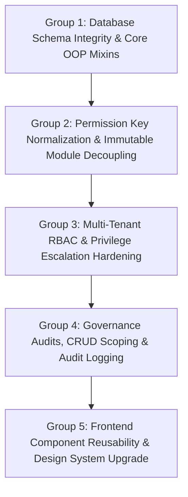
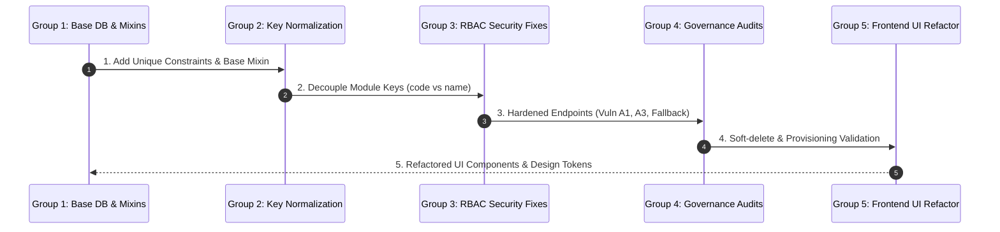

# Voatz Platform: Master Issue Catalog & Groupwise Execution Plan

---

## Executive Overview

This document synthesizes **all architectural flaws, security vulnerabilities, governance bugs, data integrity risks, and UI inconsistencies** identified across the Voatz platform during in-depth code reviews and audit reports (`voatz_rbac_audit.md`, `voatz_rbac_governance_audit.md`, `voatz_master_rbac_architecture.md`, `voatz_refactoring_and_design_system_plan.md`).

All identified issues are organized into **5 logical execution groups**. Fixing issues group-by-group ensures that database constraints and core mixins are established first before dependent security, API, and UI components are refactored.

---

## Master Issue Catalog (Groupwise)

---

### GROUP 1: Database Schema Integrity & Core OOP Mixins

Focus: Database model safety, composite uniqueness, query DRYness, and standardized API response formats.

| Issue ID | Severity | File / Location | Description & Root Cause | Impact |
|---|---|---|---|---|
| **ISSUE-1.1** | 🔴 Critical | `role_permission.py` `user_permission.py` `user_role.py` `company_module.py` | Missing composite unique constraints on junction tables (`RolePermissionMapping`, `UserPermissionMapping`, `UserRoleMapping`, `CompanyModule`). | Allows duplicate permission and role mapping rows, causing non-deterministic authorization logic and database bloat. |
| **ISSUE-1.2** | 🟠 High | `app/models/base.py` All model files | Absence of a base `TenantScopedMixin` and `StatusEnum` (`1=ACTIVE, 0=INACTIVE, 9=DELETED`). | Forces repetitive `.filter(company_id == ...).filter(status == 1)` logic across 20+ backend route files; risk of forgetting tenant filters. |
| **ISSUE-1.3** | 🟠 High | `app/utils/response.py` All route files | Inconsistent API JSON responses (some return raw arrays, others return `{data: ...}` or `{message: ...}`). | Breaks frontend data parsers and causes inconsistent error handling across pages. |
| **ISSUE-1.4** | 🟡 Medium | `user_role.py` | Implicit `status` column inheritance from `TimestampAuditMixin` not explicitly declared. | Developers reading the model file cannot tell `status` exists without checking mixin inheritance. |

---

### GROUP 2: Permission Key Normalization & Immutable Module Decoupling

Focus: Decoupling frontend permission checks and route navigation from human-editable display names.

| Issue ID | Severity | File / Location | Description & Root Cause | Impact |
|---|---|---|---|---|
| **ISSUE-2.1** | 🔴 Critical | `PermissionContext.js` `menu.py` `Sidebar.js` | Permissions and sidebar routing check mutable `display_name` (e.g. `"User Management"`) instead of immutable canonical `code` (e.g. `"users"`). | Renaming a module display name in Admin UI instantly breaks all user permissions and sidebar navigation links. |
| **ISSUE-2.2** | 🟠 High | Frontend UI Components (`*Button.js`, `<PermissionGuard>`) | UI action elements do not check explicit canonical permission keys (`module:action`). | Render-defense failure; buttons remain visible/clickable even if user lacks permission. |
| **ISSUE-2.3** | 🟡 Medium | `seed_data.py` `SystemModule` model | Seed scripts and module creation default to mutable string names without canonical key fields. | Inconsistent module keys across environments. |

---

### GROUP 3: Multi-Tenant RBAC & Privilege Escalation Hardening

Focus: Eliminating privilege escalation vulnerabilities, improper fallbacks, and company lockout risks.

| Issue ID | Severity | File / Location | Description & Root Cause | Impact |
|---|---|---|---|---|
| **ISSUE-3.1** | 🔴 Critical | `companies.py:146-147` | When creating a company without `system_module_ids`, backend falls back to provisioning **ALL active system modules**. | Company Super Admins automatically gain access to unpurchased/unprovisioned platform modules. |
| **ISSUE-3.2** | 🔴 Critical | `roles.py:137` (Vuln A1) | `create_role()` allows any user with `role:create` permission to send `is_super_admin=True`. | **Privilege Escalation**: Non-super admins can create a shadow Super Admin role and assign it to themselves. |
| **ISSUE-3.3** | 🔴 Critical | `user_roles.py:222-243` (Vuln A3) | `remove_role_from_user()` allows removing `is_super_admin` role assignments without admin checks or "last Super Admin" checks. | **Company Lockout**: A regular user could remove the Company Super Admin role, leaving the company with zero admins. |
| **ISSUE-3.4** | 🟠 High | `module_actions.py:169-199` (Vuln A7) | Platform Admins can delete default system actions (`view`, `create`, `update`, `delete`). | Deleting standard actions breaks permission checking system-wide. |
| **ISSUE-3.5** | 🟡 Medium | `roles.py:158-170` (Vuln A8) | System permits creating multiple `is_super_admin=True` roles per company. | Data inconsistency and user role assignment confusion. |
| **ISSUE-3.6** | 🟡 Medium | `user_roles.py:246-280` (Vuln A4) | Deactivated Super Admin mappings can be reactivated by regular users with `user_role:update` permission. | Backdoor privilege reactivation. |
| **ISSUE-3.7** | 🟠 High | `companies.py` (Issue A5) | Missing explicit Company Module provisioning CRUD endpoints (`GET/POST/DELETE /api/companies/<id>/modules`). | Platform Admins cannot grant/revoke modules for existing companies without manual DB edits. |

---

### GROUP 4: Governance Audits, CRUD Scoping & Audit Logging

Focus: Resolving findings from `voatz_rbac_audit.md` (unprovisioned permission assignments, hard deletes, performance scans).

| Issue ID | Severity | File / Location | Description & Root Cause | Impact |
|---|---|---|---|---|
| **ISSUE-4.1** | 🟠 High | `permissions_crud.py:43-49` | `POST /permissions/role` does not validate if `module_id` is provisioned for the company (`CompanyModule`). | Phantom permission rows created in DB that give zero access. |
| **ISSUE-4.2** | 🟠 High | `permissions.py:296-299` | `update_role_permissions` performs physical `DELETE` on `RolePermissionMapping` rows. | Destroys historical audit trail of role permission modifications; unrecoverable wipes. |
| **ISSUE-4.3** | 🟠 High | `permissions.py:491-492` | `get_user_permissions_for_management` falls back to showing all system modules for Platform Admins when company has zero provisioned modules. | Presentation-layer mismatch; shows admins modules that cannot be accessed by tenant users. |
| **ISSUE-4.4** | 🟠 High | `utils/__init__.py:317-358` | Platform Administrator permission bypass executes without detailed logging in `audit_logs` table. | Missing compliance audit trail for high-privilege administrative actions. |
| **ISSUE-4.5** | 🟡 Medium | `utils/__init__.py:247-253` | `check_user_permission()` scans all system modules in memory on every request (O(N) scan). | Performance bottleneck on permission-gated API endpoints. |
| **ISSUE-4.6** | 🟡 Medium | `auth.py:101-106` | Login queries users by email across all companies without company scope. | Potential timing side-channel and user identity leakage across tenants. |

---

### GROUP 5: Frontend Component Reusability & UI Design System Upgrade

Focus: Functional DRYness, modern glassmorphic visual aesthetics, and single-modal user experience.

| Issue ID | Severity | File / Location | Description & Root Cause | Impact |
|---|---|---|---|---|
| **ISSUE-5.1** | 🟠 High | React Page Components | State logic (loading, errors, search, modal state) duplicated across `Departments.js`, `Roles.js`, `Users.js`, `Modules.js`. | Code duplication and maintenance overhead. Create reusable `useCrudState()` hook. |
| **ISSUE-5.2** | 🟠 High | Delete Dialog UI | Redundant 2-step delete confirmation modal pops up twice on delete. | Frustrating user experience. Implement unified single `<DeleteConfirmModal />`. |
| **ISSUE-5.3** | 🟠 High | UI Design & CSS Tokens | Outdated basic UI styling. | Lacks modern aesthetic appeal. Upgrade to Indigo/Slate glassmorphic theme, Inter typography, pill `<StatusBadge />`, and `<StatusToggle />`. |
| **ISSUE-5.4** | 🟡 Medium | `api.js` catch blocks | Frontend API call catch blocks swallow backend error strings, displaying generic `"Failed to load"` toasts. | Users cannot see detailed validation or authorization error messages. |

---

## Sequential Implementation Roadmap (Step-by-Step)

### Execution Strategy

1. **Step 1 (Group 1 Fixes)**: Update models (`role_permission.py`, `user_permission.py`, `user_role.py`, `company_module.py`) with unique constraints. Build `TenantScopedMixin` & `ApiResponse` wrapper in `app/models/base.py` & `app/utils/response.py`.
2. **Step 2 (Group 2 Fixes)**: Ensure `SystemModule` has immutable `code` field. Update `PermissionContext.js` and `menu.py` to evaluate module `code`.
3. **Step 3 (Group 3 Fixes)**: Modify `companies.py` to default `system_module_ids` to empty list. Add `is_administrator()` checks on `is_super_admin` in `roles.py` and `user_roles.py`. Build company module CRUD endpoint.
4. **Step 4 (Group 4 Fixes)**: Update `permissions_crud.py` with `CompanyModule` provisioning checks. Convert physical deletes in `permissions.py` to soft deletes (`status=0`).
5. **Step 5 (Group 5 Fixes)**: Implement `useCrudState()` hook, `<DeleteConfirmModal />`, `<StatusBadge />`, and Slate/Indigo design system styles in `index.css`.
